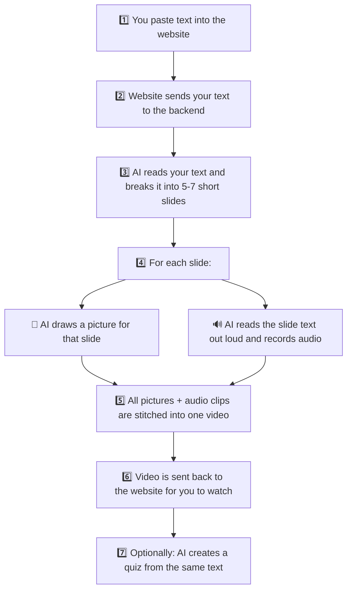
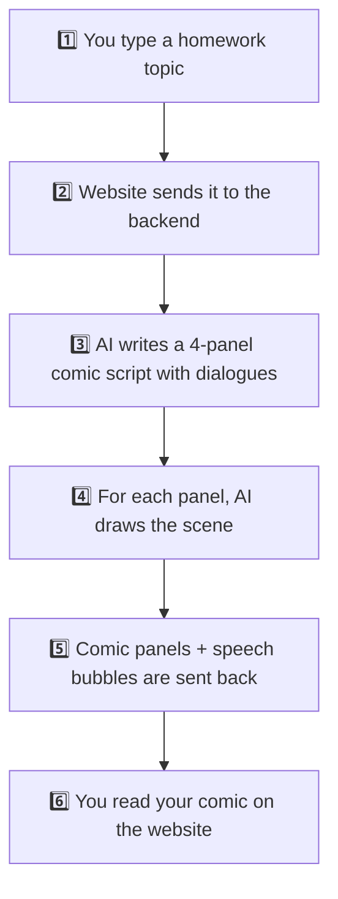
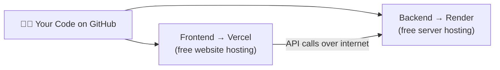
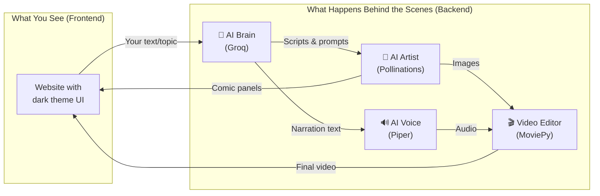

# How This Project Works — Simple Explanation

> The **VLQ Platform** is an educational app with two tools: **AMIVI** (makes videos from text) and **AMICO** (makes comics from homework). Here's how it all works in plain English.

---

## What Does This App Do?

Think of it like a **smart study helper** with two superpowers:

| Tool | What it does | Example |
|------|-------------|---------|
| **AMIVI** | You give it text → it creates a video with pictures and voice narration + a quiz | Paste a paragraph about photosynthesis → get a narrated slideshow video |
| **AMICO** | You give it a homework topic → it draws a comic book about it | Type "explain gravity" → get a 4-panel comic strip |

---

## How is the Project Organized?

The project has **two halves** that talk to each other:

```
📁 comic/
├── 📁 frontend/   ← The website the user sees (buttons, pages, animations)
├── 📁 backend/    ← The "brain" that does the heavy AI work behind the scenes
└── 📄 render-build.sh  ← A setup script for deploying the backend
```

Think of it like a **restaurant**:
- **Frontend** = the dining room (menus, tables, waiters — what customers see)
- **Backend** = the kitchen (chefs, ovens, recipes — where food is actually made)
- The waiter (API calls) carries orders from the dining room to the kitchen and brings back the food

---

## How AMIVI Works (Text → Video)

When you paste text and click **"Generate AMIVI"**, here's what happens step by step:



### In even simpler words:

1. **You paste text** (like a textbook paragraph)
2. **AI breaks it into bite-sized pieces** (5–7 short slides)
3. **For each piece, AI does two things:**
   - Draws a picture that explains the idea
   - Records a voice reading a short explanation
4. **All slides get combined into a single video** (like a mini YouTube lesson)
5. **You can also take a quiz** — AI creates 5 multiple-choice questions from your text

---

## How AMICO Works (Homework → Comic)

When you type a homework topic and click **"Generate Comic"**:



### In even simpler words:

1. **You type a topic** (e.g., "how does photosynthesis work?")
2. **AI writes a comic story** — 4 panels with character dialogues
3. **AI draws each panel** as an image
4. **You read the comic** on screen, panel by panel

---

## What AI Services Power This?

The backend uses **4 different AI tools**, each doing one job:

| Service | What it does | Tool used | Cost |
|---------|-------------|-----------|------|
| 🧠 **Brain** | Reads text, writes scripts, creates quizzes | Groq (Llama 3.1 AI model) | Free tier |
| 🎨 **Artist** | Draws images from text descriptions | Pollinations.ai | Free |
| 🔊 **Voice** | Reads text out loud, creates audio files | Piper TTS (runs on your own computer) | Free |
| 🎬 **Video Editor** | Combines images + audio into a video | MoviePy (Python library) | Free |

> **Key point:** Everything is free or runs locally — no expensive API costs!

---

## What Pages Does the Website Have?

| Page | What it shows |
|------|--------------|
| **Landing** (`/`) | The welcome page — explains what the app does |
| **Login / Register** (`/login`, `/register`) | Sign in or create an account |
| **Dashboard** (`/dashboard`) | Your home screen — stats, streaks, recent projects |
| **AMIVI Studio** (`/amivi`) | Where you paste text to generate videos |
| **AMICO Creator** (`/amico`) | Where you type homework to generate comics |
| **Quiz** (`/quiz`) | Take an AI-generated quiz |
| **Library** (`/library`) | Browse all your past generated content |
| **Profile** (`/profile`) | Your user profile |
| **Settings** (`/settings`) | App settings |

---

## How Do the Frontend and Backend Talk?

The website (frontend) sends **HTTP requests** to the backend — like sending a letter and getting a reply:

| When you... | Website sends this to backend | Backend replies with |
|-------------|------------------------------|---------------------|
| Generate AMIVI | `POST /api/amivi/generate` with your text | A video URL + slide images |
| Generate AMICO | `POST /api/amico/generate` with your topic | Comic panel images + dialogues |
| Take a Quiz | `POST /api/amivi/generate_quiz` with your text | 5 quiz questions with answers |

The backend URL is set via an environment variable (`VITE_API_URL`). Locally it's `http://localhost:8000`.

---

## How is it Deployed (Put Online)?



- **Frontend** (the website) is hosted on **Vercel** — it just serves static HTML/CSS/JS files
- **Backend** (the AI kitchen) is hosted on **Render** — it runs the Python server
- When deployed, the Render build script automatically:
  1. Installs Python packages
  2. Downloads the Piper voice engine

---

## Tech Stack — What's Used to Build This

### Frontend (what the user sees):
- **React** — builds the interactive UI
- **Vite** — makes development fast (instant page refresh)
- **Tailwind CSS** — makes it look pretty with a dark theme
- **React Router** — handles page navigation without reloading
- **Lucide Icons** — provides the icons
- **Framer Motion** — adds smooth animations

### Backend (the AI brain):
- **Python + FastAPI** — the web server that handles requests
- **Groq** — super-fast AI text processing
- **Pollinations.ai** — free AI image generation
- **Piper TTS** — free offline text-to-speech
- **MoviePy** — video creation from images + audio

---

## The Big Picture — Everything Together



**That's it!** The app takes your study material, runs it through a chain of AI tools, and gives you back something visual and fun to learn from. 🎉
